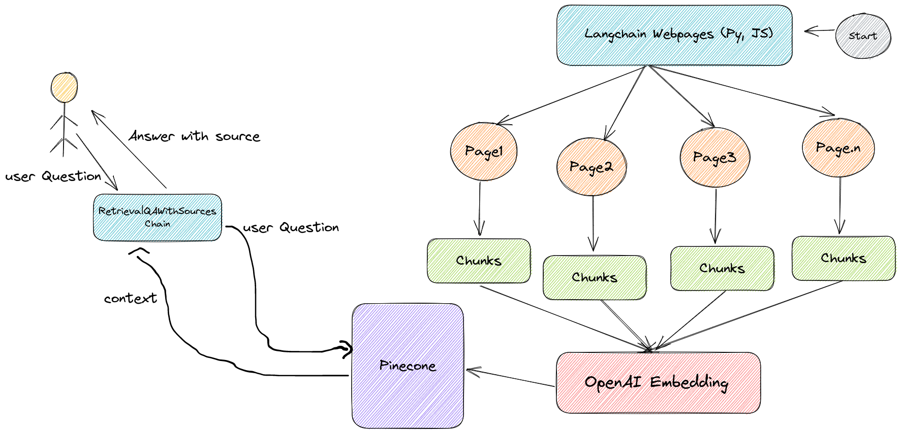

# CHAT WITH Arcafeed
[](https://www.python.org/downloads/release/python-360/)




# 0- Installation

### client
```
$ git clone git@github.com:AbdelrahmanAbounida/chat_url_bot.git
$ cd client
$ npm i 
```

### server
```
$ cd ..
$ cd server 
$ pip install -r requirements.txt
```

### .env
Create a .env file in server folder with .env.local fields 

# 1- Running

## client
```
$ cd client
$ npm run dev
```

## server
```
$ cd server
$ python application.py
```

OR 
```
$ cd server
$ docker compose build
$ docker compose up -d
```

Then u have 2 endpoints /chat and /store u can test it using postman or whatever possible as shown in the given video
